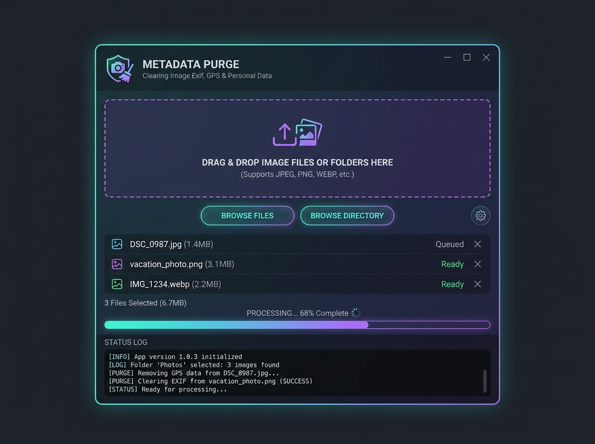

# 🧬 Очиститель метаданных картинок (Metadata Purge)

Программа для быстрой очистки скрытых данных (EXIF, GPS-координат, параметров генерации ИИ) из файлов картинок. Она стирает всю лишнюю информацию, чтобы никто не мог узнать, где было сделано фото или какой промпт использовался для генерации нейросетью.

Поддерживает форматы: **JPEG/JPG** и **PNG**.

---

## 🚀 Как установить и запустить (Инструкция)

### Шаг 1. Установите Python
Если Python ещё не установлен на компьютере:
1. Скачайте установщик для вашей системы с официального сайта: [python.org/downloads](https://www.python.org/downloads/).
2. **ВАЖНО:** При установке обязательно поставьте галочку **"Add Python to PATH"** (Добавить Python в PATH) на первом экране установщика.

### Шаг 2. Запуск программы (в один клик)
Для максимального удобства в папке создан файл автозапуска `run.bat`.
1. Просто запустите **`run.bat`** двойным кликом.
2. Программа сама проверит наличие Python, автоматически скачает и установит необходимые библиотеки (`Pillow` и `piexif`) при первом запуске, после чего откроет приложение.

---

## 📹 Текстовая видео-инструкция (Как пользоваться)

Представьте, что это пошаговая запись экрана:

1. **🎬 Запуск приложения:**
   Двойным кликом открываем файл `run.bat`. На экране на долю секунды появится черное текстовое окошко (скрипт проверяет библиотеки), а затем откроется красивое темное окно приложения с заголовком **🧬 METADATA PURGE**.

2. **📂 Добавление картинок:**
   У вас есть два пути, как добавить картинки для очистки:
   * **Вариант А:** Нажмите на большую область по центру окна (где написано «Перетащите сюда файлы...») или на кнопку **"ВЫБРАТЬ ФАЙЛЫ"** снизу. Откроется стандартное окно выбора файлов на вашем компьютере. Выберите одну или несколько картинок и нажмите "Открыть".
   * **Вариант Б (Быстрый):** Выберите файлы картинок или папку с картинками прямо в Проводнике Windows и перетащите их мышкой на иконку файла **`run.bat`**. Программа запустится и файлы уже будут добавлены в список!

3. **📃 Проверка списка и размера:**
   В средней части окна появится список добавленных файлов с их статусом и размером. В строке статуса под списком вы увидите общую информацию, например: `Выбрано файлов: 3 (6.7 MB)`.

4. **⚡ Очистка метаданных:**
   Нажмите на яркую бирюзовую кнопку **"ОЧИСТИТЬ МЕТАДАННЫЕ"** в правом углу.
   * Программа начнет быстро обрабатывать файлы по очереди.
   * Внизу в градиентной полоске прогресса (переливается от фиолетового к бирюзовому) будет показан процент выполнения.
   * В самом низу, в окне **"STATUS LOG"**, побегут зеленые строки лога. Вы увидите сообщения о том, что EXIF и параметры ИИ успешно стерты для каждого файла.

5. **🎉 Результат:**
   По окончании процесса появится всплывающее окошко с надписью: *«Очистка завершена!»*. Нажмите "ОК".
   В той же папке, где лежали ваши оригинальные картинки, появятся новые файлы с приставкой `_cleaned` (например, рядом с `vacation.jpg` появится `vacation_cleaned.jpg`). В этих файлах нет больше никаких скрытых данных, их можно смело отправлять в интернет!

6. **🧹 Очистка очереди:**
   Если вы хотите обработать новую партию файлов, нажмите красную кнопку **"ОЧИСТИТЬ СПИСОК"** и повторите шаги.
