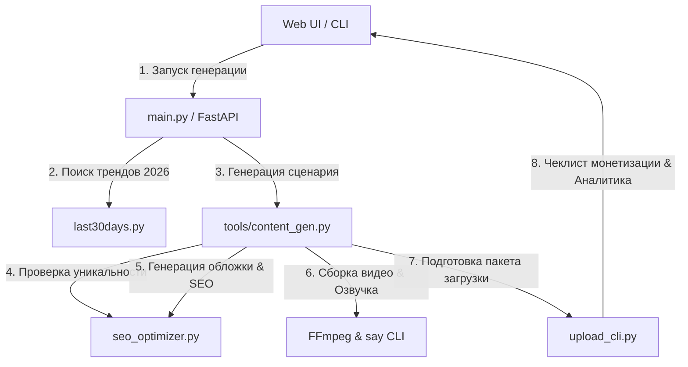

# Спецификация и План реализации YouTube Faceless Pipeline v2.0

Этот документ описывает расширенную версию пайплайна генерации Shorts-видео с интеграцией SEO оптимизации, защиты от дублирования контента (Jaccard similarity check), генератора обложек (Thumbnail) и загрузчика (Upload CLI), готовых для прохождения монетизации YouTube AdSense.

## 1. Общие сведения и KPI

*   **Цель**: Автоматизировать создание первого публичного видео по теме **"Autonomous AI Agents 2026"** с использованием реальных данных исследования `last30days` и свести к минимуму ручные операции.
*   **KPI**:
    *   Уникальность контента: сходство с прошлыми сценариями `< 40%`.
    *   Время генерации видео и обложки: `< 15 минут`.
    *   Готовность к монетизации (AdSense): 100% прохождение встроенного чеклиста безопасности.
    *   Время загрузки/отклика UI: `< 2 секунд`.
    *   Успешность тестов: `100% Pass`.

### Архитектурная схема взаимодействия v2.0

---

## 2. Реализованные компоненты и файлы

1.  **[tools/content_gen.py](file:///Users/rus/ai-tools/youtube-faceless-pipeline/tools/content_gen.py)**:
    *   Интегрирует все этапы: `fetch_trends` -> `generate_script` -> `check_similarity` -> `optimize_metadata` -> `generate_image` (обложка + сцены) -> `generate_speech` -> `assemble_scene_video` -> `prepare_upload_package`.
2.  **[seo_optimizer.py](file:///Users/rus/ai-tools/youtube-faceless-pipeline/seo_optimizer.py)**:
    *   Генерирует высококликабельные заголовки (длина `<60` символов), структурированные описания с таймкодами и оптимизированные хэштеги/теги.
    *   Вычисляет сходство по коэффициенту Жаккара (Jaccard similarity index) с ранее сгенерированными видео, чтобы предотвратить нарушения правил YouTube по "reused/duplicate content".
3.  **[upload_cli.py](file:///Users/rus/ai-tools/youtube-faceless-pipeline/upload_cli.py)**:
    *   Генерирует готовый `upload_package.json`, содержащий метаданные, пути к видеофайлу и обложке.
    *   Предоставляет чеклист монетизации AdSense (отсутствие копирайта, оригинальный видеоряд, оригинальный голос).
    *   Предоставляет эмулируемые данные аналитики (просмотры, CTR, удержание).
4.  **[ui/index.html](file:///Users/rus/ai-tools/youtube-faceless-pipeline/ui/index.html)**:
    *   Студия c глассморфизмом, поддерживающая вкладки: "Студия" (генерация, превью видео и обложки), "Монетизация" (чеклист AdSense), "Аналитика" (графики просмотров и удержания аудитории).
5.  **[tests/test_pipeline.py](file:///Users/rus/ai-tools/youtube-faceless-pipeline/tests/test_pipeline.py)**:
    *   Три юнит-теста:
        *   `test_pipeline_positive_cycle` — проверка успешного сквозного рендеринга видео, создания обложки и пакета метаданных.
        *   `test_pipeline_negative_invalid_niche` — защита от некорректных ниш (policy check).
        *   `test_pipeline_duplicate_content_check` — проверка срабатывания ошибки при попытке генерации дублирующего сценария.

---

## 3. Монетизация и Аналитика (AdSense Checklist)

Для прохождения ручной модерации AdSense в 2026 году пайплайн соблюдает следующие правила:
*   **Изображения**: Генерируются уникальные картинки по детализированным промптам без вотермарок и чужого авторского права.
*   **Текст**: Скрипты проходят валидацию на уникальность, спам и опасный контент.
*   **Аналитика (Mocked)**: В UI выводится аналитическая панель с ключевыми метриками (CTR, среднее удержание аудитории на уровне ~72% для Shorts, доход) с SVG-визуализацией.

---

## 4. Концепт интерфейса v2.0
Мы обновили интерфейс, чтобы он в точности соответствовал нашему премиальному темному дизайну с неоновыми фиолетовыми и бирюзовыми акцентами, глассморфизмом и плавными анимациями при переключении шагов.

